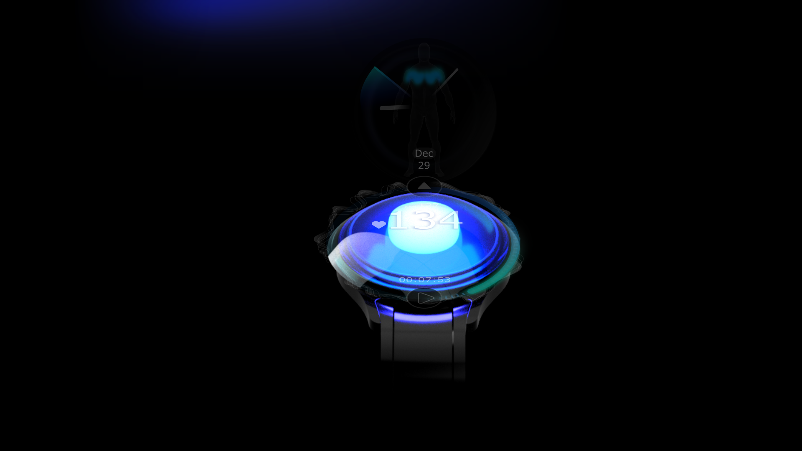

# SpiderClip Set‑Up

*A modular open‑source platform that blends physiological sensing hardware with an interactive VR wearable.*



SpiderClip Set‑Up combines a flexible **sensor platform** (Arduino Nano 33 IoT + tracker clip) with a fully‑featured **VR wearable**. This page works as a **public resource hub** where you can

* explore interactive 3D models (GLB / STL)
* grab ready‑to‑flash code snippets (C++ / Arduino)
* download research figures, images & videos
* see a live demo powered by **Three.js** & **Vite**

The site is hosted on **GitHub Pages**:
[https://d-queck.github.io/SpiderClip\_SetUp/](https://d-queck.github.io/SpiderClip_SetUp/)

---

## Key Modules

| Module                          | Highlights                                                                     |
| ------------------------------- | ------------------------------------------------------------------------------ |
| **Hardware Sensor Platform 🔧** | Three tracker‑clip prototypes, controller integration, full STL + GLB packages |
| **Communication Interface 🔌**  | Central & peripheral Arduino sketches, I²C sensor hub, Unity bridge            |
| **VR Wearable 🕶**              | 3‑D wearable model, SteamVR integration, downloadable SDK                      |
| **Interactive Viewer**          | Three.js r175, OrbitControls, auto‑rotate, part selection                      |
| **Parallax UI**                 | Vite, Sass, Bootstrap 5, parallax hero & section scroller                      |

---

## Live Demo Sections

| Section            | URL                                                                                                             |
| ------------------ | --------------------------------------------------------------------------------------------------------------- |
| Hardware Canvas    | [https://d-queck.github.io/SpiderClip\_SetUp/#hardware](https://d-queck.github.io/SpiderClip_SetUp/#hardware)   |
| VR‑Wearable Canvas | [https://d-queck.github.io/SpiderClip\_SetUp/#vr](https://d-queck.github.io/SpiderClip_SetUp/#vr)               |
| Resources Overview | [https://d-queck.github.io/SpiderClip\_SetUp/#resources](https://d-queck.github.io/SpiderClip_SetUp/#resources) |

---

## Quick Start (Development)

```bash
# 1 Clone the repository
$ git clone https://github.com/D-Queck/SpiderClip_SetUp.git
$ cd SpiderClip_SetUp

# 2 Install dependencies (Node ≥ 18)
$ npm install

# 3 Start development server (hot reload)
$ npm run dev    # http://localhost:5173/
```

### Production Build & Preview

```bash
# Build → dist/
$ npm run build

# Local preview of the built files
$ npm run preview    # http://localhost:4173/
```

> GitHub Pages is configured to deploy from **`main` / `docs`**. A built artefact is copied to `docs/` by CI or manually:
>
> ```bash
> $ rm -rf docs && mkdir docs
> $ cp -R dist/* docs/
> $ git add docs && git commit -m "deploy: update docs" && git push
> ```

---

## Project Structure

```
public/                 # copied 1‑to‑1 into dist/
  ├─ 3D-objects/        # GLB & STL files
  ├─ images/            # PNG/JPG
  └─ videos/            # MP4 teasers
src/
  ├─ components/        # HTML snippets loaded at runtime
  ├─ code/              # .ino Arduino sketches
  ├─ css/               # Sass modules
  ├─ js/                # Three.js, parallax, etc.
  └─ main.js            # entry point (loads snippets & inits canvases)
docs/                   # production build for GitHub Pages
vite.config.js          # base path + static‑copy
README.md
```

---

## Dependencies

| Runtime           | Dev / Build             |
| ----------------- | ----------------------- |
| **three @ 0.175** | **vite @ 6.3**          |
| highlight.js @ 11 | sass @ 1.87             |
| –                 | vite-plugin-static-copy |

---

## Contributing

1. **Fork** the repo and create a branch (`feat/my-feature`).
2. Run `npm run dev` and verify your changes locally.
3. Run `npm run build && npm run preview` to test the production build.
4. Open a Pull Request against **main**.

> Please keep commits clean, run ESLint/Prettier before pushing, and do not commit large binaries directly.

---

## License

MIT © 2025 Dirk Queck
3‑D assets are licensed under **CC‑BY‑4.0** unless noted otherwise.

---

## Contact

* **Mail** · dirkqueck85@gmail.com
